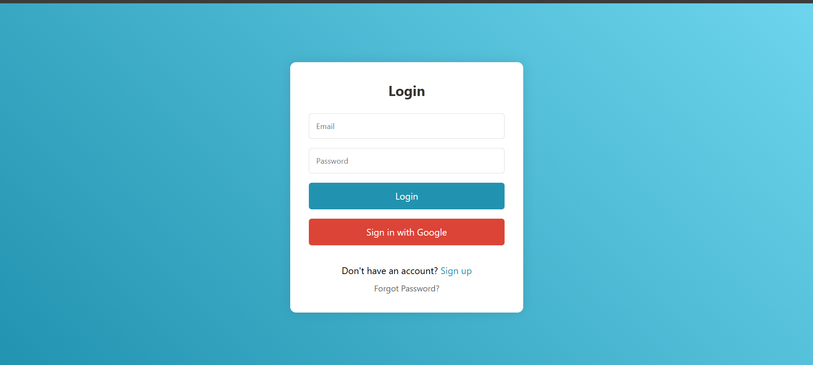
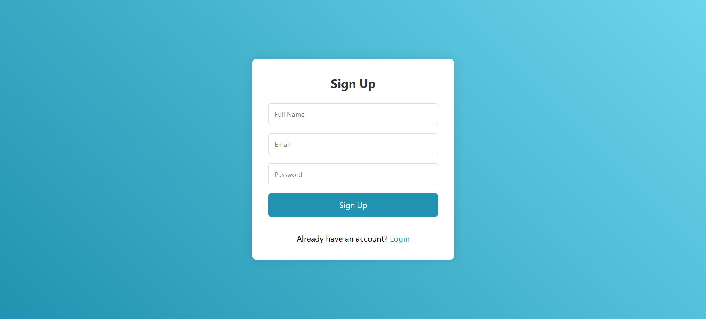

# 🔥 Firebase Authentication - Login & Signup

Welcome to the **Firebase Authentication** project! This repository provides a simple and efficient way to integrate **Login and Signup** functionality using Firebase with **HTML, CSS, and JavaScript**.

---

## 🚀 Features

- ✅ User **Signup** with Email & Password  
- ✅ User **Login** with Email & Password  
- ✅ Firebase **Authentication** Integration  
- ✅ Secure **Firestore Database** for storing user data  
- ✅ **Responsive UI** built with HTML, CSS, and JavaScript  

---

## 🎯 Preview  

  
  
  

---

## 📂 Project Structure  

```
📦 firebase-auth-app
 ┣ 📂 img
 ┣ 📜 firebaseConfig.js
 ┣ 📜 index.html
 ┣ 📜 Readme.md
 ┣ 📜 script.js
 ┗ 📜 style.css

```

---

## 🔧 Installation & Setup  

### 1️⃣ Clone the Repository  

```sh
git clone https://github.com/vansh-frontend/login-with-firebase
cd login-with-firebase
```

### 2️⃣ Setup Firebase  

1. Go to [Firebase Console](https://console.firebase.google.com/)  
2. Create a new Firebase project  
3. Enable **Authentication** (Email & Password)  
4. Create a Firestore Database (if needed)  
5. Copy your Firebase configuration and paste it into `firebase-config.js`  

```js
// firebase-config.js
const firebaseConfig = {
  apiKey: "YOUR_API_KEY",
  authDomain: "YOUR_AUTH_DOMAIN",
  projectId: "YOUR_PROJECT_ID",
  storageBucket: "YOUR_STORAGE_BUCKET",
  messagingSenderId: "YOUR_MESSAGING_SENDER_ID",
  appId: "YOUR_APP_ID"
};

firebase.initializeApp(firebaseConfig);
const auth = firebase.auth();
```

---

## 🔑 User Authentication Flow  

1️⃣ **Signup Page**: Users can create an account with Email & Password.  
2️⃣ **Login Page**: Users can log in with their credentials.  
3️⃣ **Dashboard**: Users can access a protected page after authentication.  

---


## 🌟 Contributing  

We welcome contributions! Feel free to **fork** this repo, create a new branch, and submit a pull request.  

---


## 📞 Contact  

For any queries, reach out to **Vansh Dhalor** at **vanshdhalor04@gmail.com**  

